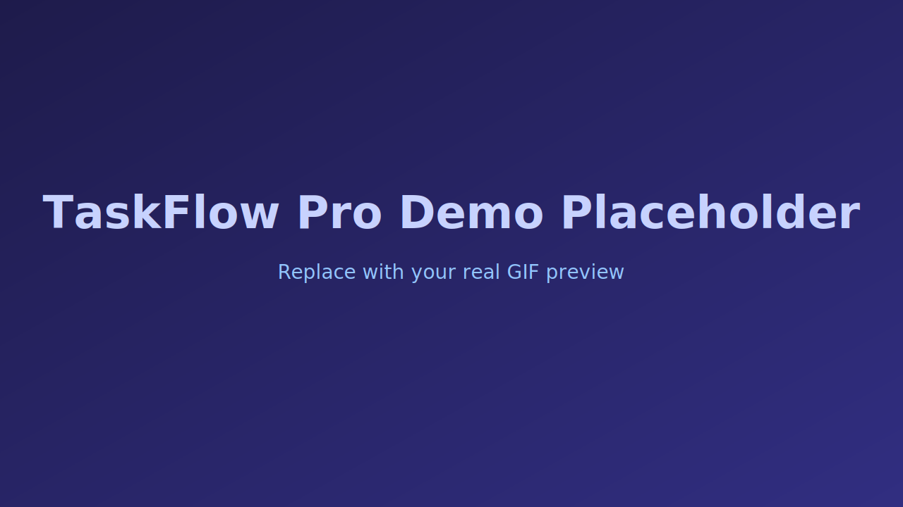
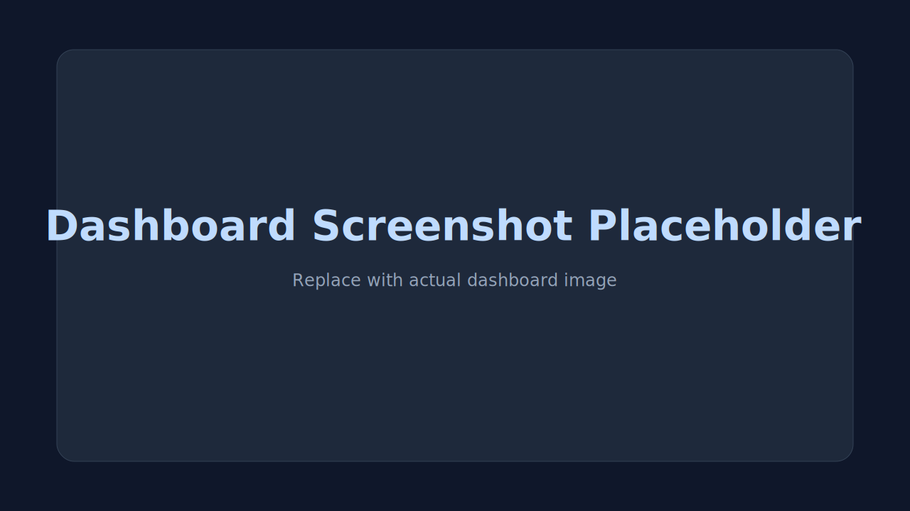
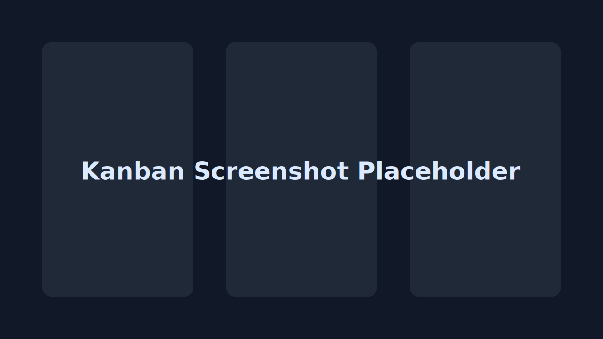
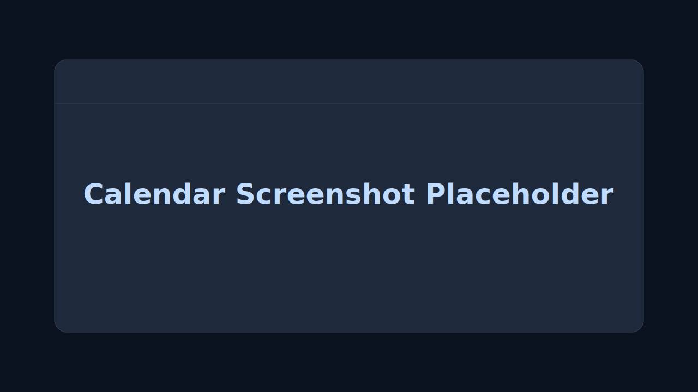
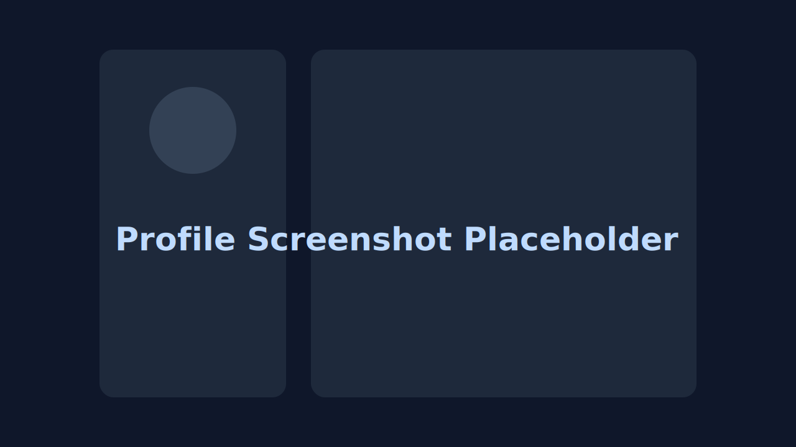

# TaskFlow Pro - Full-Stack Task Management Platform

<p align="center">
  
</p>

<p align="center">
  
</p>

<p align="center">
  
  
  
  
</p>

---

## Overview

TaskFlow Pro is a production-style full-stack task management app built for personal productivity and team collaboration.  
It includes authentication, board-based task workflows, comments, attachments, notifications, analytics, and a Pomodoro focus module.

---

## Core Features

- Secure auth flow: signup, login, forgot/reset password, protected routes
- Board-based workspace with member/invitation support
- Task lifecycle management: create, edit, delete, status updates
- Multiple task views: Grid, Kanban, Calendar
- Assignments, comments with mentions, and activity history
- Attachment uploads on tasks (image-based upload flow)
- Notification center + unread counter + mark-as-read actions
- Deadline reminder notifications + email reminders
- Productivity dashboard with analytics, charts, and Pomodoro widget
- Profile management with profile picture upload/delete
- Dark mode + responsive mobile-first UI + micro interactions/animations

---

## Tech Stack

### Frontend
- React 19
- Vite 7
- React Router
- Tailwind CSS + DaisyUI
- Axios
- React Hook Form
- React Hot Toast
- React DatePicker
- dnd-kit
- React Icons / Lucide Icons

### Backend
- Node.js + Express
- MongoDB + Mongoose
- JWT + bcryptjs
- Multer (file handling)
- Cloudinary (media upload)
- Nodemailer (email notifications)
- Cookie-based auth + CORS protections

---

## Project Structure

```text
.
├── backend/
│   ├── src/
│   │   ├── config/
│   │   ├── controllers/
│   │   ├── database/
│   │   ├── library/
│   │   ├── middleware/
│   │   ├── models/
│   │   ├── routes/
│   │   ├── validators/
│   │   └── index.js
│   └── package.json
├── frontend/
│   ├── public/
│   ├── src/
│   │   ├── components/
│   │   ├── context/
│   │   ├── hooks/
│   │   ├── library/
│   │   ├── pages/
│   │   ├── App.jsx
│   │   ├── main.jsx
│   │   └── index.css
│   └── package.json
├── package.json
└── README.md
```

---

## Environment Variables (`backend/.env`)

```env
PORT=5001
MONGODB_URI=your_mongodb_connection_string
JWT_SECRET=your_jwt_secret
FRONTEND_URL=http://localhost:5173

# Cloudinary
CLOUDINARY_NAME=your_cloudinary_name
CLOUDINARY_API_KEY=your_cloudinary_api_key
CLOUDINARY_API_SECRET=your_cloudinary_api_secret

# Mailer (if configured in your project)
MAIL_HOST=your_smtp_host
MAIL_PORT=587
MAIL_USER=your_email
MAIL_PASS=your_password
MAIL_FROM=your_from_email
```

---

## Local Setup

### 1) Install dependencies (root helper script)

```bash
npm run build
```

### 2) Run backend

```bash
cd backend
npm run dev
```

### 3) Run frontend

```bash
cd frontend
npm run dev
```

### 4) Production start

```bash
npm start
```

---

## Scripts Reference

### Root
- `npm run build` -> installs backend/frontend dependencies and builds frontend
- `npm start` -> starts backend in production mode

### Backend (`backend/package.json`)
- `npm run dev` -> nodemon dev server
- `npm run start` -> node production server

### Frontend (`frontend/package.json`)
- `npm run dev` -> vite dev server
- `npm run build` -> vite build
- `npm run preview` -> preview production build
- `npm run lint` -> eslint
- `npm run deploy` -> publish `dist` to GitHub Pages

---

## API Surface (High-Level)

- `POST /api/auth/*` -> auth + password + profile APIs
- `GET/POST/PUT/PATCH/DELETE /api/task/*` -> task CRUD, status, assign, comments, attachments
- `GET/POST/PATCH /api/board/*` -> board and invitation flows
- `GET/PUT/DELETE /api/notifications/*` -> notifications lifecycle

---

## Route Access

### Public
- `/home`
- `/signup`
- `/login`
- `/forgot-password`
- `/reset-password/:token`

### Protected
- `/dashboard`
- `/profile`

---

## UI/UX Notes

- Mobile-responsive layout across major pages
- Smooth animated sections and interaction feedback
- Tap bounce and micro-scale effects on key controls
- Slide transitions for mobile sidebar
- Scroll-optimized task and modal sections

---

## Why This Project Stands Out

- Full-stack architecture with realistic product-level modules
- Feature depth beyond CRUD (boards, productivity, reminders, notifications)
- Clean separation of concerns (controllers/services/validators)
- Scalable path for real-time events, RBAC, and audit enhancements

---

## Live Demo

- **Frontend (GitHub Pages):** [https://mrpar.github.io/Task-Management-System-2-main/](https://mrpar.github.io/Task-Management-System-2-main/)
- **Backend API (Render):** [https://task-management-system-api.onrender.com/api/health](https://task-management-system-api.onrender.com/api/health)

> Tip: If you deploy frontend on GitHub Pages and backend on Render/Railway, keep both links here for quick verification.

---

## Screenshots / GIF Preview

### Product Walkthrough (GIF)



### Screenshots






> Preview placeholder assets are included in `frontend/public/previews/`.  
> Replace these `.svg` files with your real `.png`/`.gif` captures anytime.

---

## Contributors

Thanks to everyone who contributed to this project.

- **Sanjib** - Core development, architecture, and UI/UX implementation

If you want to contribute:

1. Fork the repository
2. Create a feature branch (`feature/your-feature-name`)
3. Commit your changes
4. Open a Pull Request

---

## License

This project is currently unlicensed for public reuse by default.

If you want to open-source it, add a `LICENSE` file (recommended: MIT) and update this section:

```text
MIT License
Copyright (c) 2026 Sanjib
```

---

## Maintainer

**Sanjib**  
Built with focus on clean UX, practical workflows, and production-ready structure.
